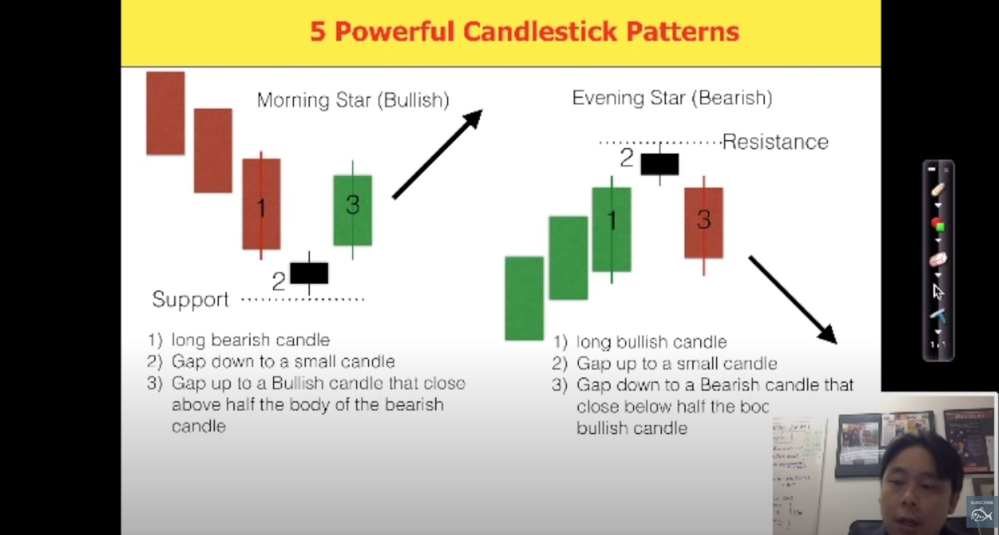
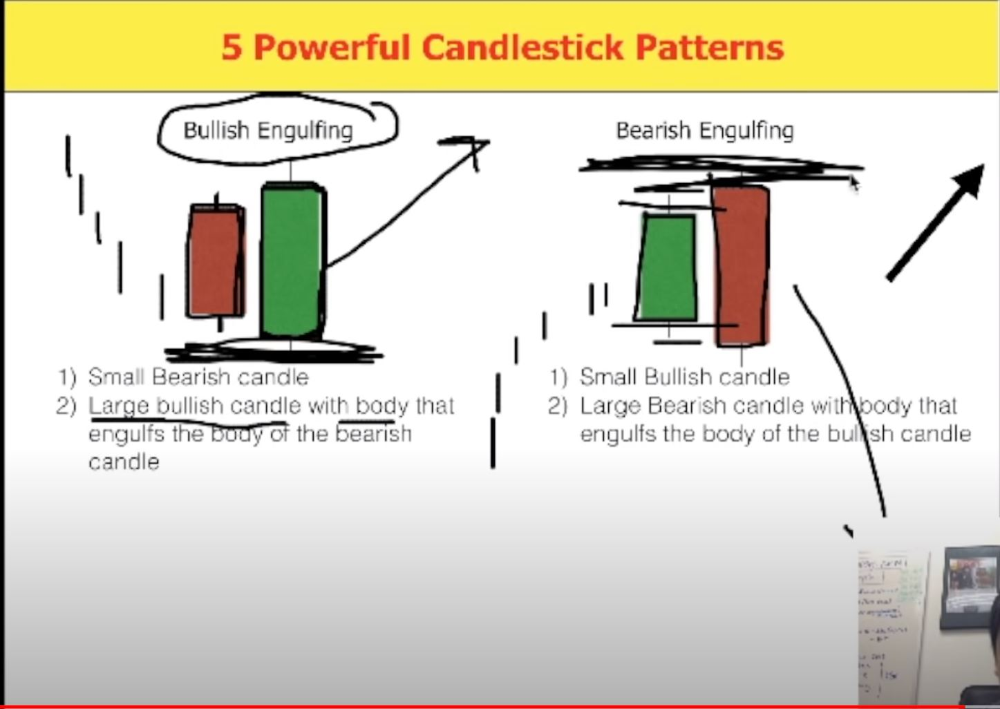
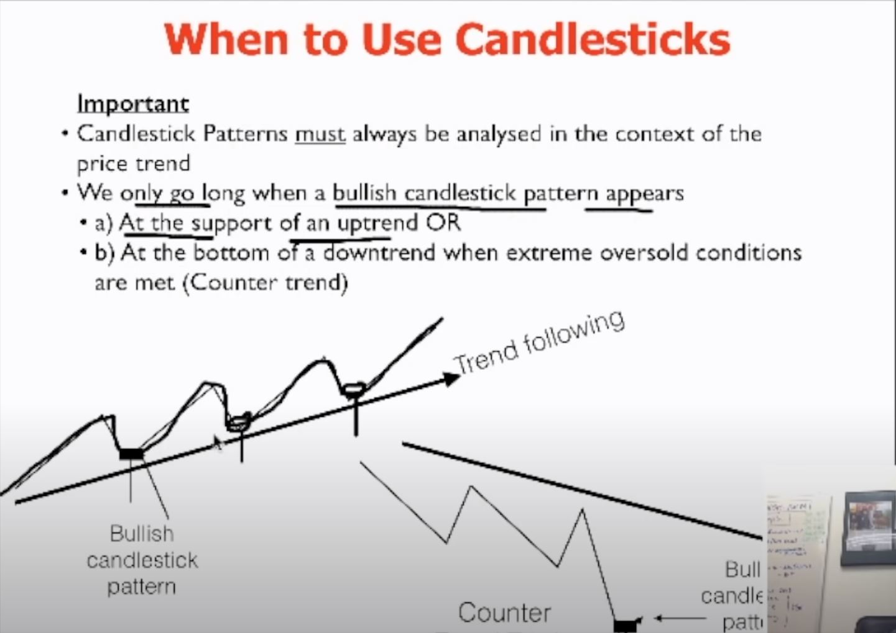

### Five Power Candlestick Patterns in Stock Trading Strategies by Adam Khoo:

Resource:[here](https://www.youtube.com/watch?v=hoGkfzJeR6A)

---
#### 5 Powerful Candlesticks patterns:

1) __Bullish & Bearish Pin:__ When the candle is bullish but the difference between open and close is little, but there is a long lower shadow (2/3 of the whole candle stick's length). 

When we have a group of bearish candles coming but at the bottom we see a bullish pin, there is a high probability that the trend is going up. In order for a bullish to be reliable it has to be in the right context,. 
##### If the following conditions are met, we will make the trade:
- We need to make sure the lower shadow cuts below a support level. (moving average)
- The moving averages must be in sequence showing an obvious uptrend.

Bearish pin is opposite of bullish pin. Here is the photo of it: 

the conditions above for bullish pin is true for the bearish ones, reversely. The bearish must be seen on a downtrend and it has to have a support level at a moving average.

2) __Tweezer Bottoms (bullish) and Teezer Tops(bearish):__ When at the bottom of a downtrend, we see a bearish candle with shadows smaller than the body, and right next to it we have an INDENTICAL bullish candle with the same size but opposite direction.

Reason: the reason is, in fact this combination at the end of a trend is equivalent to a bullish pin. and he calls this combination a synthetic bullish pin. 
The conditions must be met also just like the bullish pins, where both of the candlesticks should have a test to a support level (moving average), and it must be on a uptrend. 

Twizzer tops is exactly opposite of the bottoms.

3) __One White Soldier (bullish) vs One Black Crow (bearish):__ 
One white soldier is a bullish candle  that opens above close on the previous bearish candle and closes above the open of the previous day's bearish candle. In case of shadows, we need to make sure also that the lower shadow of the bullish is above the lower shadow of the bearish. and the upper shadow of the bullish is above the upper shadow of the bearish.
This candle is a very good sign of the starting of an uptrend, if it is in the right context, which means it has to be on an uptrend, and it should cut through a support level (moving average) 

One black crow is the opposite of the above one, for the bearish situation.

4) __Morning Star (Bullish) & Evening Star (Bearish):__
The definition of morning star, is the combination three candles:
- A big bearish candle
- A small candle with ideally similar length of up and down shadows. (the direction can be either bullish or bearish). this candle is the sign of indesicision in the market. 
- A big bullish candle	that closes at least above 50% of the bearish candle.
There should be a gap between the end of the bearish candle and beginning of the morning star. and also a gap between the end of morning star and beginning of the bullish candle.
-- The big candle can have a small body (by big we mean the difference between the top and bottom shadows)
This combination is a very powerful reversal pattern. We can go long here, and put the buy a bit above the end of the bullish candle and the stop loss a bit under the shadow of the morning star.
__IMPORTANT:__ The morning star should be see on a support level, and ideally it's better to be in an uptrend.
As seen in the image below, the evening start is just opposite the morning star.

5) __Bullish and Bearish Engulfing:__
A smallish bearish which has its BODY engulfed (covered fully) by a BODY of a big bearish candle. Of course the bull has to be at a support level. or be on an uptrend.

Remeber we only use candlesticks in the context of the price trend. 

> Written with [StackEdit](https://stackedit.io/).