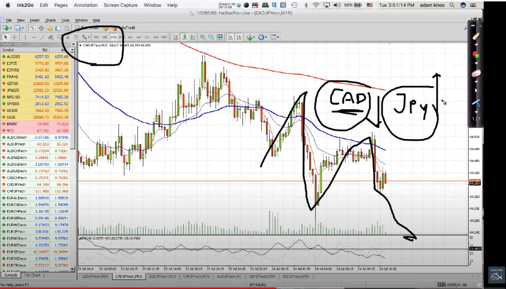

###   Using Correlation in Forex Trading by Adam Khoo
Here is the [source]([https://youtu.be/4GmaK-fmSsE)

- He created a profile for each currency. For example he trades the most 8 popular currencies and for each one he has a profile (group) of pairs including the currency. e.g. USD profile includes (EURUSD, USDCAD, USDCHF, AUDUSD, NZDUSD, GBPUSD, USDJPY)
- He has another profile called "watchlist" that everyday when he sees there is a potential pattern formation, he puts (or maybe copies that pair into watchlist profile.
- He uses this setup to watch the correlations. For example if he sees CADJPY is going down it shows that CAD is going bearish, and JPY is getting bullish. In order for him to make sure CAD is going down, he looks at all other CAD pairs. Once he sees all CAD pairs showing that CAD is going bearish, he gets more confidence about his assumption.

He looks also at JPY profile to see if all JPY pairs are going bullish or not. 
If both of the currencies show the expected behavior, we can check other indicators and if we find any opportunity we can do the trade.
