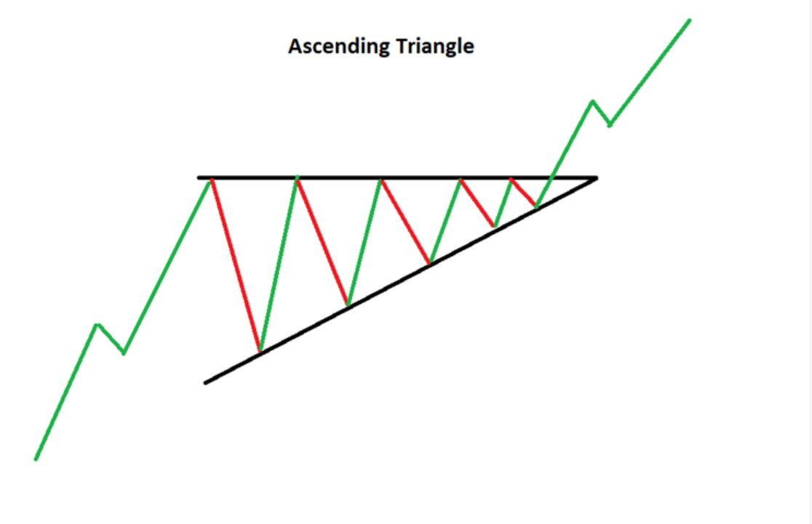
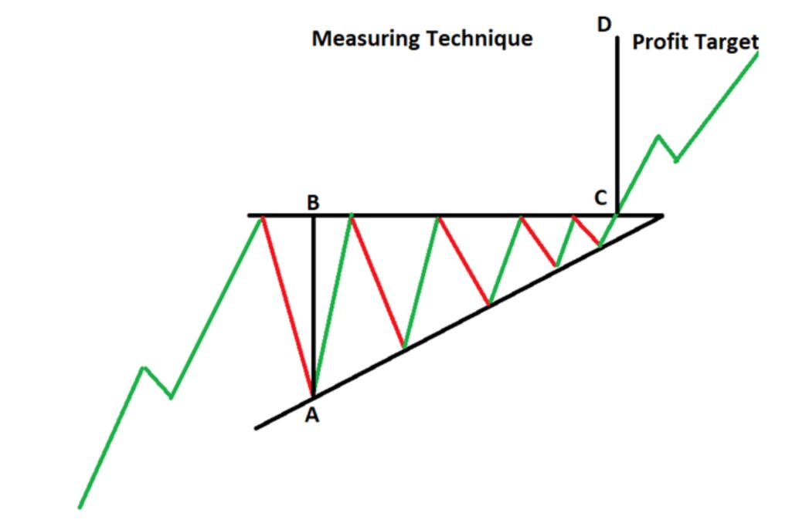
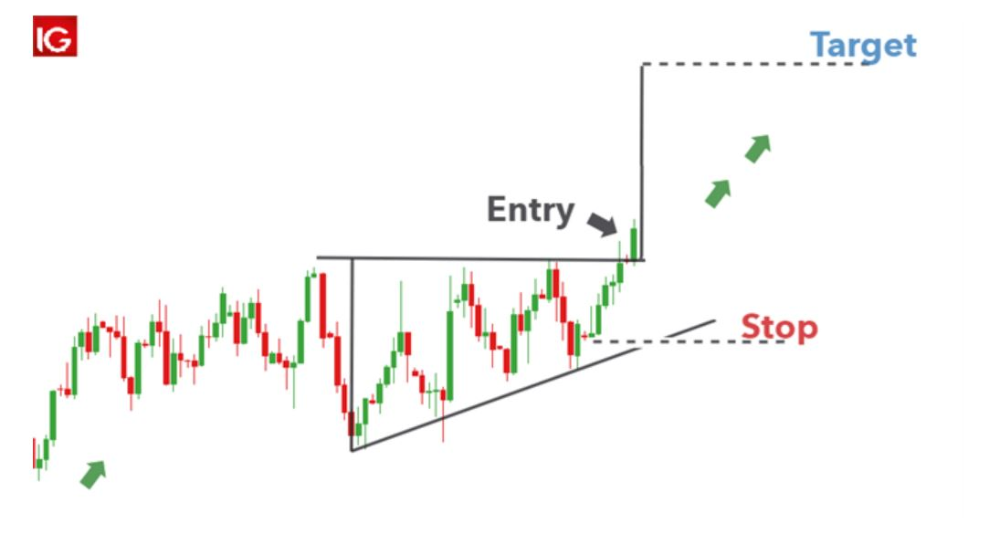
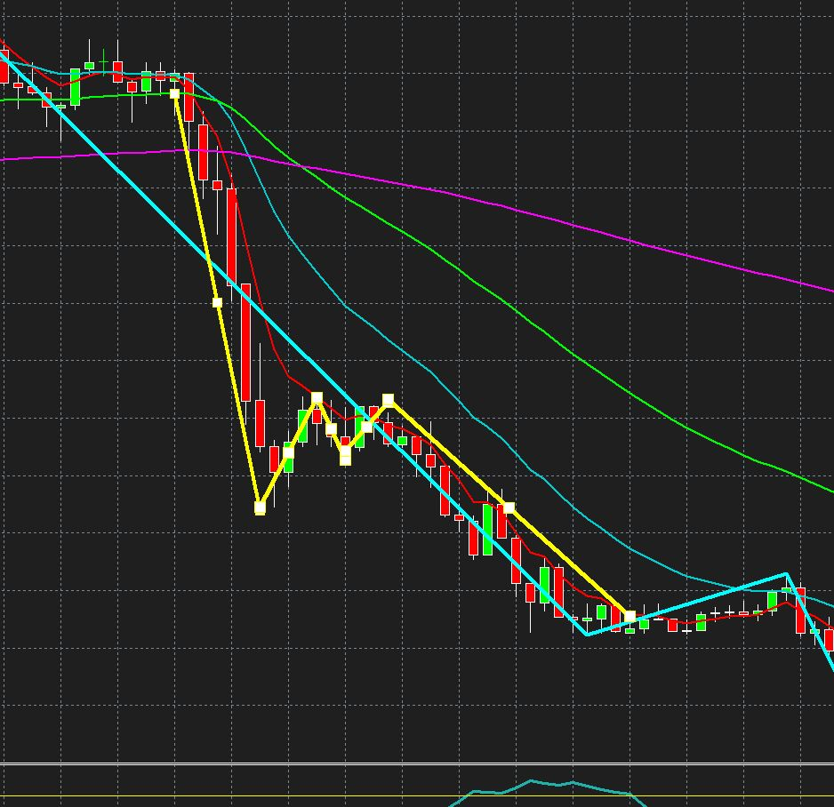
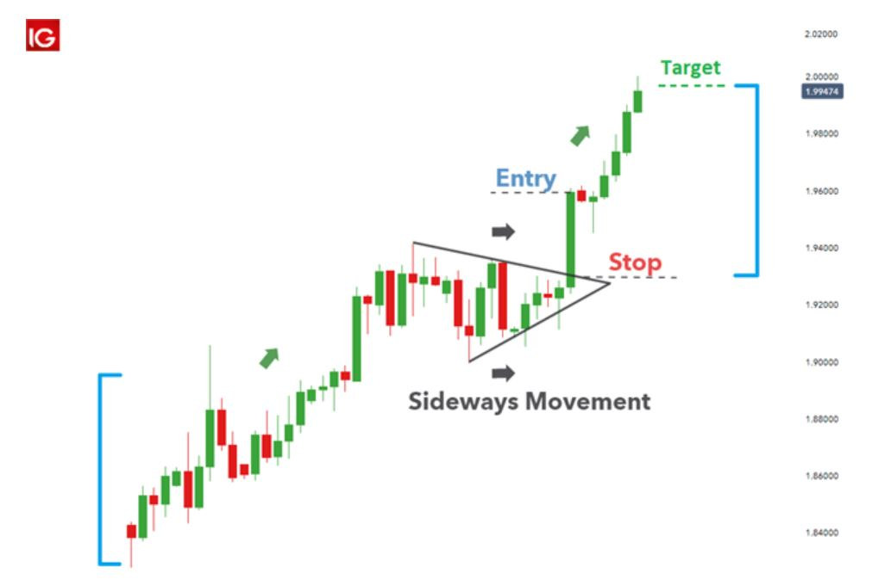
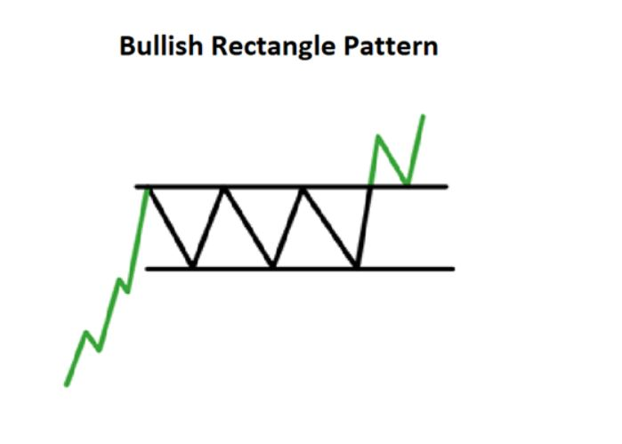
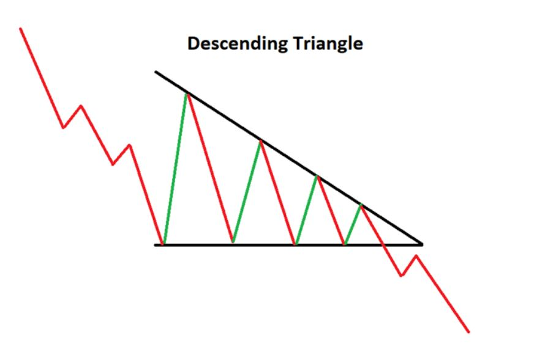

### Consolidation Patterns:
1) **Bullish: Ascending Triangle:**
When on an uptrend, we have a consolidation where the highs are getting flat and this flat line will act as a resistance, but the we are having higher lows. It shows that buyers are more aggressive. 
In this situation we expect the uptrend to break out in the same uptrend direction.

- How much profit we can get from ascending triangles? 
When we connect the first consolidation low cycle with the vertical support line, that distance can be taken as the profit at the end of the consolidation.

Once we figure out the triangle, we anticipate to see an uptrend break out. Once we see a strong outbreak above the resistance, we can go long. we set the stop loss right below the latest consolidation low.

2) **Bullish/Bearish Pennant:**
A Pennant pattern is a continuation chart pattern, seen when a security experiences a large upward or downward movement, followed by a brief consolidation, before continuing to move in the same direction. The pattern looks like a small symmetrical triangle called a Pennant.

Here is an example I found:

Here is how we trade a pennant:

3) **Bullish Flag:**
The bull flagis characterized by a downward sloping channel denoted by two parallel trendlines against the preceding trend. It has to happen after a strong sudden bullish jump.

4) **Bullish Rectangle Pattern:** 
The rectangle pattern characterizes a pause in trend whereby price moves sideways between a parallel support and resistance zone. The pattern indicates a consolidation in price before continuing in the original direction of the existing trend. The added benefit of this pattern is that traders have the opportunity to trade within the range or trade the eventual breakout, or both

5) **Descending Triangle:**
The descending triangle  pattern  is a consolidation pattern that occurs mid-trend and usually signals a continuation of the existing downtrend. The pattern is formed by drawing two converging trendline (descending upper trendline and flat lower trendline), as price temporarily moves in a sideways direction. Traders look for a subsequent breakout, in the direction of the preceding trend, as a milestone to enter a trade.

> Written with [StackEdit](https://stackedit.io/).