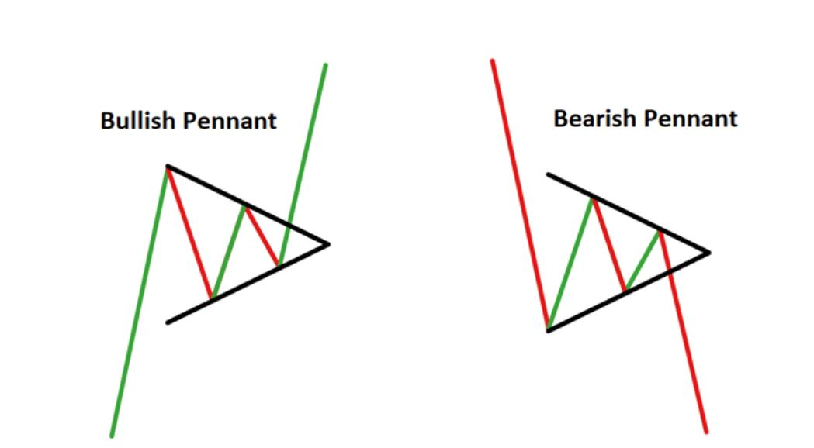
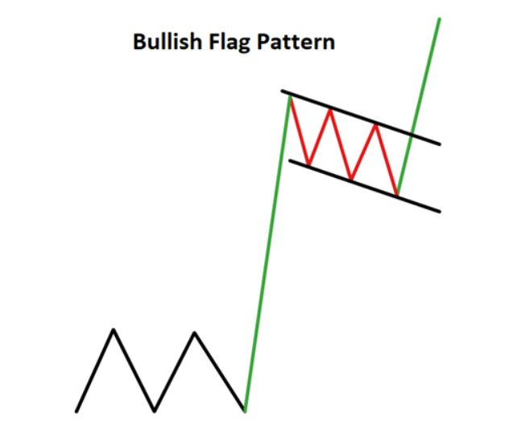
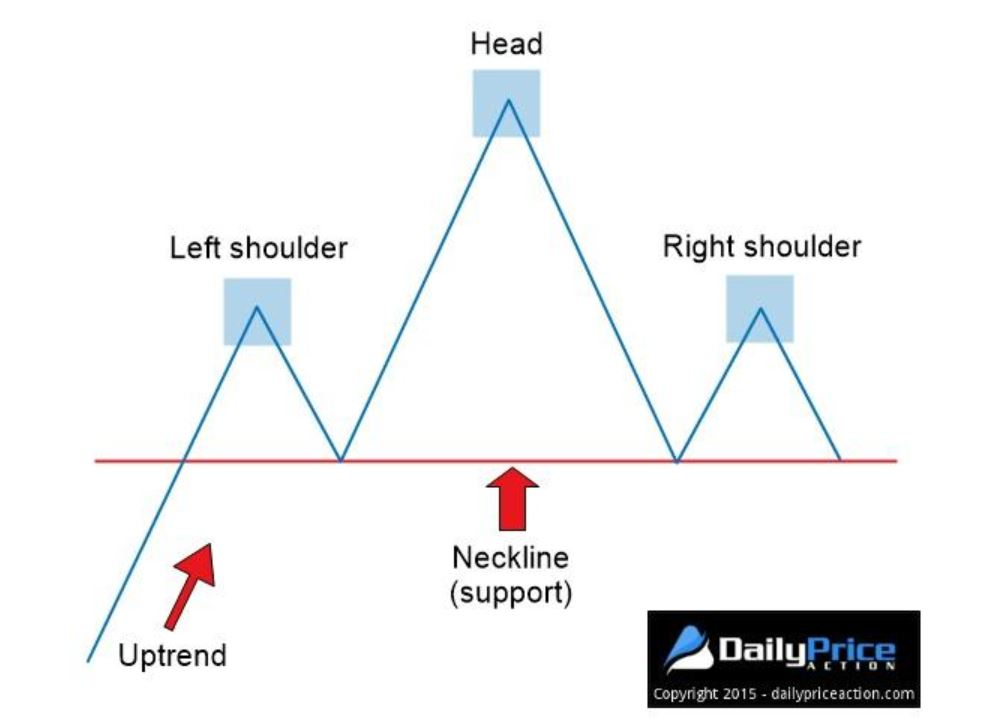
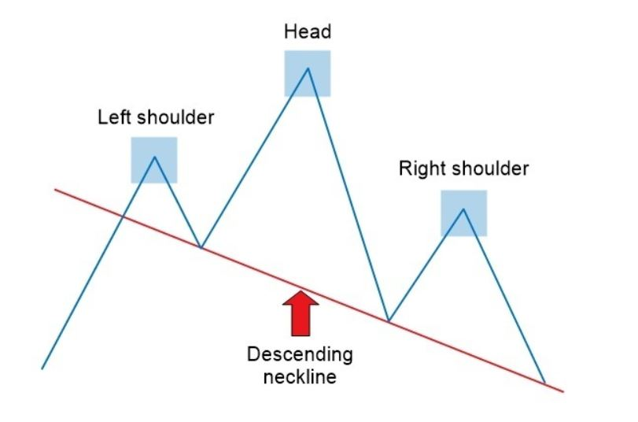

### Consolidation Patterns:
1) **Bullish: Ascending Triangle:**
When on an uptrend, we have a consolidation where the highs are getting flat and this flat line will act as a resistance, but the we are having higher lows. It shows that buyers are more aggressive. 
In this situation we expect the uptrend to break out in the same uptrend direction.

- How much profit we can get from ascending triangles? 
When we connect the first consolidation low cycle with the vertical support line, that distance can be taken as the profit at the end of the consolidation.

Once we figure out the triangle, we anticipate to see an uptrend break out. Once we see a strong outbreak above the resistance, we can go long. we set the stop loss right below the latest consolidation low.

2) **Bullish/Bearish Pennant:**
A Pennant pattern is a continuation chart pattern, seen when a security experiences a large upward or downward movement, followed by a brief consolidation, before continuing to move in the same direction. The pattern looks like a small symmetrical triangle called a Pennant.

Here is an example I found:

Here is how we trade a pennant:

3) **Bullish Flag:**
The bull flagis characterized by a downward sloping channel denoted by two parallel trendlines against the preceding trend. It has to happen after a strong sudden bullish jump.

4) **Bullish Rectangle Pattern:** 
The rectangle pattern characterizes a pause in trend whereby price moves sideways between a parallel support and resistance zone. The pattern indicates a consolidation in price before continuing in the original direction of the existing trend. The added benefit of this pattern is that traders have the opportunity to trade within the range or trade the eventual breakout, or both

5) **Descending Triangle:**
The descending triangle  pattern  is a consolidation pattern that occurs mid-trend and usually signals a continuation of the existing downtrend. The pattern is formed by drawing two converging trendline (descending upper trendline and flat lower trendline), as price temporarily moves in a sideways direction. Traders look for a subsequent breakout, in the direction of the preceding trend, as a milestone to enter a trade.

6) ** Bearish Flag Pattern:**
similar to bullish flag. it has to have a flag pole (means a sudden big drop) then it will look like this:

7) ** Bearish Rectangle:** 
similar to bullish rectangle:

### Other shapes:
8) **Double Top:**
when on an uptrend, the price gets touched twice, then goes down and being retested at least once, we should expect the price to fall.

Here is the example I found:

Here is a warning video:

And Here is a how to do video:

8) **Head & Shoulders:**
When we have all these 5 items happening, we call it head and shoulders:
- Uptrend
- Left shoulder
- Head
- Right shoulder
- Neckline

we need both shoulders and the head of the pattern before we can identify the neckline.
> As a general rule, the longer the uptrend lasts, the more substantial the reversal is likely to be.

Concerning the head and shoulders pattern, the message is that buyers are tiring and that you’d best prepare for a potential reversal. When we see a head and shoulders as soon as we have a bearish break out after the right shoulder, we can go short. This video explains it well:
<iframe width="674" height="379" src="https://www.youtube.com/embed/Byaq0bUsXeg" frameborder="0" allow="accelerometer; autoplay; encrypted-media; gyroscope; picture-in-picture" allowfullscreen>
</iframe>
Here is the example I found:

The stop loss can be set above the right shoulder.
__IMPORTANT:__ The neckline should be horizontal or ascending but never descending.
The one below is descending and it is a sign of a weak reversal pattern.

> Head and Shoulders work best with daily and weekly timeframes.

> Written with [StackEdit](https://stackedit.io/).